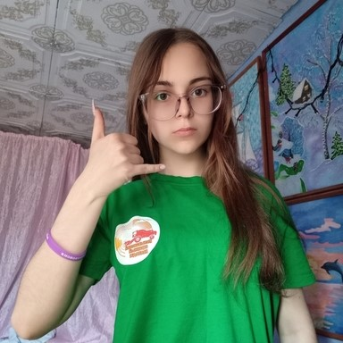
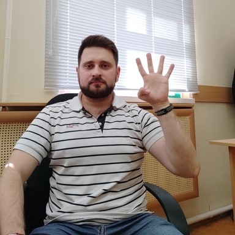
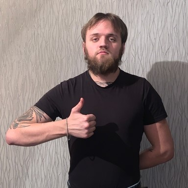
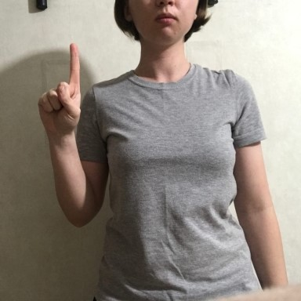
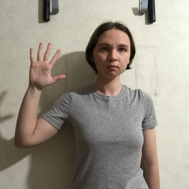
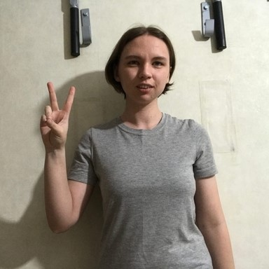
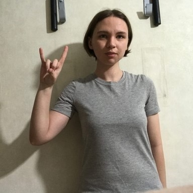
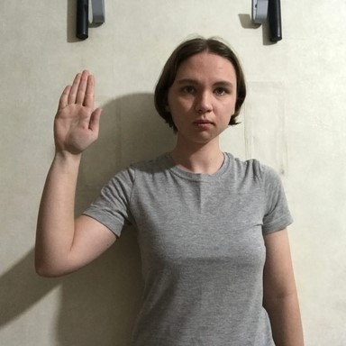
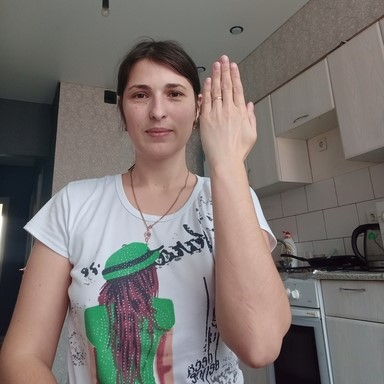
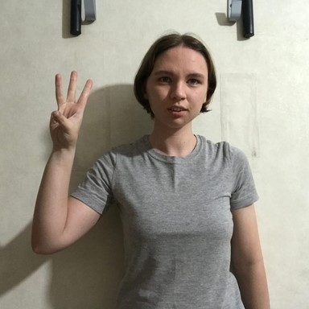

# IceVision → OpenVINO → Unity Tutorial (Not Finished)
This tutorial covers training an object detector with the [IceVision](https://airctic.com/0.12.0/) library and implementing it in a [Unity](https://unity.com/) game engine project using the [OpenVINO Toolkit](https://docs.openvino.ai/latest/index.html).

https://user-images.githubusercontent.com/9126128/183220227-868d552b-c67e-48b6-97f9-433c5634230a.mp4

## Training Code

| Jupyter Notebook                                             | Colab                                                        | &nbsp;&nbsp;&nbsp;&nbsp;&nbsp;&nbsp;&nbsp;&nbsp;Kaggle&nbsp;&nbsp;&nbsp;&nbsp;&nbsp;&nbsp;&nbsp;&nbsp; |
| ------------------------------------------------------------ | ------------------------------------------------------------ | ------------------------------------------------------------ |
| [GitHub Repository](https://github.com/cj-mills/icevision-openvino-unity-tutorial/blob/main/notebooks/Icevision-YOLOX-to-OpenVINO-Tutorial-HaGRID.ipynb) |  |  |

**Note:** The free GPU tier for Google Colab takes approximately 11 minutes per epoch, while the free GPU tier for Kaggle Notebooks takes around 19 minutes per epoch.

**Reference Images**

## Kaggle Datasets

* [HaGRID Sample 30k 384p](https://www.kaggle.com/datasets/innominate817/hagrid-sample-30k-384p)
* [HaGRID Sample 120k 384p](https://www.kaggle.com/datasets/innominate817/hagrid-sample-120k-384p)

## Reference Images

 

| Class    | Image                                              |
| --------- | ------------------------------------------------------------ |
| call    |  |
| dislike         |  |
| fist    |  |
| four         |  |
| like         |  |
| mute         |  |
| ok    |  |
| one         |  |
| palm         |  |
| peace         |  |
| peace_inverted         |  |
| rock         |  |
| stop         |  |
| stop_inverted         |  |
| three         |  |
| three2         |  |
| two_up         |  |
| two_up_inverted         |  |
|
||